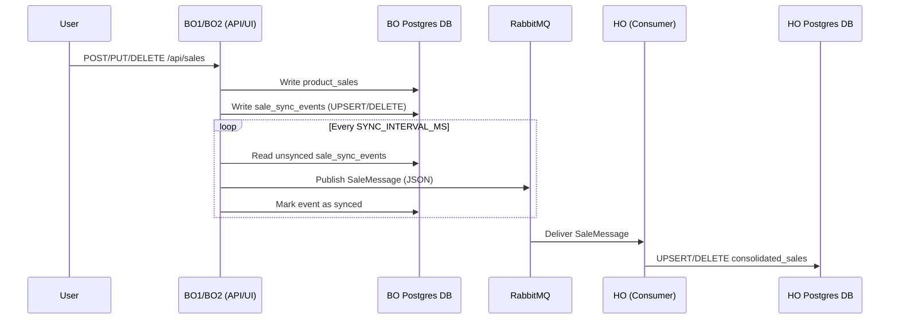

# Project Guide — Distributed Sales DB Synchronisation (BO1, BO2 → HO)

This repository implements a simple **event-driven synchronization** pattern:

- **BO1** and **BO2** are “branch office” apps. Each has its own PostgreSQL database and its own local CRUD UI/API.
- **HO** is the “head office” app. It consumes RabbitMQ messages and maintains a **consolidated** sales table.

The sync is **asynchronous** and **eventually consistent**: BO changes are written locally first, then published to RabbitMQ later by a scheduler, then applied to HO.

---

## Architecture

Services (Docker Compose defaults):

- **HO backend**: http://localhost:8080
- **BO1 producer**: http://localhost:8081
- **BO2 producer**: http://localhost:8082
- **RabbitMQ management UI**: http://localhost:15672
- **Adminer** (DB UI): http://localhost:8085

Data stores:

- One PostgreSQL container hosting 3 logical databases:
  - `bo1_db`
  - `bo2_db`
  - `ho_db`

Messaging:

- **RabbitMQ** exchange/queue configured by env vars:
  - Exchange: `RABBITMQ_EXCHANGE` (topic exchange)
  - Queue: `RABBITMQ_QUEUE`
  - Routing key: `RABBITMQ_ROUTING_KEY`

### Message flow (high level)



---

## Data model

### BO databases (BO1 and BO2)

BO persists two tables via JPA (`spring.jpa.hibernate.ddl-auto=update`):

1. `product_sales`
   - The _source of truth_ for that BO.
   - Entity: `ProductSale`.

2. `sale_sync_events`
   - A local “pending work” table.
   - Each BO write generates a row:
     - `operation`: `UPSERT` or `DELETE`
     - `sale_id`: local sale id in `product_sales`
     - Snapshot fields for UPSERT (date/region/product/qty/cost/amt/tax/total)
     - `synced`: boolean

This is conceptually similar to an **outbox**, but implemented as a normal JPA entity/table.

### HO database

HO stores the consolidated view:

- Table: `consolidated_sales`
- Entity: `ConsolidatedSale`
- Unique constraint on `(bo_id, local_sale_id)`
  - This is what makes HO **idempotent** for UPSERT operations.

HO also stores `received_at` (timestamp) to show when it last applied the message.

---

## Message contract (RabbitMQ payload)

The message is JSON serialized from `SaleMessage` (same fields in BO and HO):

- `operation`: `UPSERT` or `DELETE`
- `boId`: `BO1` or `BO2`
- `localSaleId`: BO-local id
- For UPSERT also includes: `date`, `region`, `product`, `qty`, `cost`, `amt`, `tax`, `total`

Both producer and consumer configure Jackson with `JavaTimeModule` so `LocalDate` works.

Notes:

- For `DELETE`, only `operation`, `boId`, and `localSaleId` are required by HO.
- Messages are published with delivery mode `PERSISTENT`.

---

## BO behavior (producer side)

### Local CRUD + sync-event creation

BO exposes a REST API and serves a small static UI (in `src/main/resources/static/index.html`).

When you create/update/delete a sale:

- `BoSalesController` handles `/api/sales`.
- `BoSalesService` performs:
  - **Create**: save `ProductSale`, then insert `SaleSyncEvent(UPSERT)`
  - **Update**: update `ProductSale`, then insert `SaleSyncEvent(UPSERT)`
  - **Delete**: insert `SaleSyncEvent(DELETE)`, then delete `ProductSale`

Important detail: these methods are `@Transactional`, so the BO write and the sync-event write happen in one DB transaction.

### Scheduled publishing

`SalesSyncScheduler` runs every `SYNC_INTERVAL_MS` and:

1. Loads up to 100 pending events: `findTop100BySyncedFalseOrderByIdAsc()`
2. Maps each `SaleSyncEvent` into a `SaleMessage`
3. Publishes via `SalePublisherService` using `RabbitTemplate.convertAndSend(exchange, routingKey, payload)`
4. Marks the event as synced

If publishing fails (exception), the event stays unsynced and will be retried on the next scheduler run.

---

## HO behavior (consumer side)

HO declares the RabbitMQ topology on startup:

- Durable queue
- Durable topic exchange
- Binding (queue -> exchange with the routing key)

Then it listens to the queue:

- `SalesMessageListener.consumeSale` is a `@RabbitListener(queues = "${rabbitmq.queue}")`

Consumer logic:

- If `operation == DELETE`:
  - `deleteByBoIdAndLocalSaleId(boId, localSaleId)`
- Else (UPSERT):
  - Find existing by `(boId, localSaleId)`
  - If not found, create a new `ConsolidatedSale` and set `boId` + `localSaleId`
  - Map fields and set `receivedAt = now()`
  - Save

Because of the unique constraint + “find then save” logic, applying the same UPSERT multiple times will converge to the same row.

---

## REST APIs

All three apps expose CRUD at `/api/sales`.

### BO1 / BO2 endpoints

- `GET /api/sales` — list local BO rows
- `POST /api/sales` — create local sale (also creates a pending sync event)
- `PUT /api/sales/{id}` — update local sale (also creates a pending sync event)
- `DELETE /api/sales/{id}` — delete local sale (also creates a pending sync event)

Example request body (BO create/update):

```json
{
  "date": "2026-04-15",
  "region": "North",
  "product": "Keyboard",
  "qty": 2,
  "cost": 10.0,
  "amt": 20.0,
  "tax": 4.0,
  "total": 24.0
}
```

### HO endpoints

- `GET /api/sales` — list consolidated rows (sorted by newest receive time)
- `POST /api/sales` — manually create a consolidated row
- `PUT /api/sales/{id}` — manually update a consolidated row
- `DELETE /api/sales/{id}` — manually delete a consolidated row

Note: HO’s POST/PUT are for manual management; the primary way rows appear is via RabbitMQ consumption.

---

## Configuration (env vars)

Each Spring Boot module loads optional module-local `.env` files using:

- `spring.config.import=optional:file:.env[.properties]`

Key variables:

- `SERVER_PORT`
- `DB_URL`, `DB_USERNAME`, `DB_PASSWORD`
- `RABBITMQ_HOST`, `RABBITMQ_PORT`, `RABBITMQ_USERNAME`, `RABBITMQ_PASSWORD`
- `RABBITMQ_EXCHANGE`, `RABBITMQ_ROUTING_KEY`
- BO only: `BO_ID`, `SYNC_INTERVAL_MS`
- HO only: `RABBITMQ_QUEUE`

When you run with Docker Compose, those vars are injected by Compose directly.

---

## Running the full stack (recommended)

1. Create a root `.env`:

   ```bash
   cp .env.example .env
   ```

   Fill at least:
   - `POSTGRES_USER`, `POSTGRES_PASSWORD`
   - `RABBITMQ_USERNAME`, `RABBITMQ_PASSWORD`

2. Start everything:

   ```bash
   docker compose up -d
   ```

3. Open BO1 / BO2 and create rows:

- BO1 UI: http://localhost:8081
- BO2 UI: http://localhost:8082
- HO UI: http://localhost:8080

4. Wait up to `SYNC_INTERVAL_MS` (default 10s). The data should appear in HO.

### Database initialization (`init-db.sql`)

`init-db.sql` is mounted into Postgres at `docker-entrypoint-initdb.d/`.

- It creates `bo1_db`, `bo2_db`, `ho_db`.
- It only runs automatically **when the Postgres volume is empty**.

If you already have an existing `pg_data` volume, you may need to:

- drop/recreate the volume, or
- manually create the missing databases.

---

## Operational notes / limitations

- **Eventual consistency**: HO updates lag behind BO by up to `SYNC_INTERVAL_MS`.
- **Retry strategy**: BO retries publishing by leaving events unsynced on failure; there’s no DLQ/backoff policy yet.
- **Ordering**: across BO1 and BO2 there is no global ordering; HO applies messages as they arrive.
- **Schema management**: JPA auto-updates tables; there are no SQL migrations.

If you want stronger guarantees, typical next steps are: publisher confirms, dead-letter queues, and/or a more formal outbox pattern.
